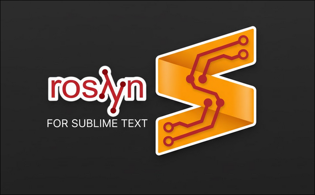

# LSP-Roslyn (For Sublime Text)

[中文文档](README_cn.md) | English

This is a C# LSP plugin for Sublime Text. Unlike LSP-OmniSharp, LSP-Roslyn directly uses Microsoft's Roslyn as the backend, which is the same backend used by the current Visual Studio Code C# Extension and C# Dev Kit.



Compared to the OmniSharp solution, it offers more modern feature design and better performance.

## Requirements

- Sublime Text 4 (Build 4107 or later)
	- Build 4107 : 20 May 2021
- **[LSP](https://packagecontrol.io/packages/LSP)** Package Installed via Package Control
- **[.NET SDK 9.0 or higher](https://dotnet.microsoft.com/download)** installed (at least you need dotnet 9.0 runtime to make Roslyn work)

## Plugin Installation

### 1. Via Package Control (Coming Soon)

1. First, ensure that the LSP plugin is installed in Sublime Text
2. Install the LSP-Roslyn plugin through Package Control

### 2. Manual Installation

Clone the plugin repository to your Sublime Text Packages directory:

```bash
# macOS
cd "~/Library/Application Support/Sublime Text/Packages"
# Windows (PowerShell)
cd "$env:APPDATA\Sublime Text\Packages"
# Linux
cd "~/.config/sublime-text/Packages"
# Install by git
git clone https://github.com/ownself/LSP-Roslyn.git
```

# Roslyn Installation

### 1. Automatic Download

Under normal circumstances, when you open a .cs file with Sublime Text, it will automatically search for .sln and .csproj files and enable LSP-Roslyn.

When enabled for the first time, the plugin will attempt to automatically download the corresponding Roslyn executable based on your operating system and extract it to the plugin directory.

Therefore, simply wait a moment. After the download completes, it will automatically extract and start Roslyn, and Sublime Text's C# LSP functionality will automatically take effect.

Current automatic download Roslyn version:

- Pre-Release : 5.3.0-1.25517.107

Supported system platforms for automatic download:

- win-x86
- win-x64
- win-arm64
- osx-x64
- osx-arm64
- linux-x64
- linux-arm64

### 2. Manual Download

If automatic download doesn't work, or if your platform is not in the plugin's default supported list, you may need to manually download Roslyn and extract it to the Microsoft.CodeAnalysis.LanguageServer directory within the plugin directory under Sublime Text's Packages.

For more information about downloading Roslyn executable files, please refer to [roslyn-packages](https://github.com/dotnet/roslyn/blob/main/docs/wiki/NuGet-packages.md)

# Configuration

You can configure settings through `Preferences: LSP-Roslyn Settings` in the Command Palette:

```json
{
    "settings": {
        // Specify default solution if multiple .sln files exist
        "roslyn.defaultLaunchSolution": "MyProject.sln",
		// Background analysis
        "roslyn.backgroundAnalysis": {
            "dotnet_analyzer_diagnostics_scope": "openFiles",  // or "fullSolution", "none"
            "dotnet_compiler_diagnostics_scope": "openFiles"
        },
		// Inlay Hints
        "roslyn.inlayHints": {
            "csharp_enable_inlay_hints_for_implicit_variable_types": true,
            "dotnet_enable_inlay_hints_for_parameters": true
        },
		// Code Lens
	    "roslyn.codeLens": {
            "dotnet_enable_references_code_lens": true,
            "dotnet_enable_tests_code_lens": true
        },
		// better performance for large solution
		"roslyn.loadProjectsOnDemand": true,
    }
}
```

# Features

**Core Features**

- **Code Completion** - IntelliSense and auto-completion suggestions
- **Signature Help** - Parameter information for methods
- **Hover Information** - Documentation and type information
- **Go to Definition** - Jump to function definitions
- **Find References** - List all references
- **Rename** - Rename across projects

**Advanced Features**

- **Code Actions** - Quick fixes and refactoring
- **Code Lens** - Inline reference count indicators
- **Inlay Hints** - Type and parameter hints
- **Diagnostics** - Real-time error and warning notifications
- **Formatting** - Automatic code formatting
- **Symbol Search** - Project-wide function definition search
- **Source Generators** - Source file generation support

**Roslyn Analyzers**

- **Built-in Analyzers** - Code quality and style analysis
- **Custom Analyzers** - Support for third-party analyzers
- **EditorConfig** - Support for .editorconfig settings

# Commands

Commands available in the Command Palette:

- **LSP-Roslyn: Restart Server** - Restart LSP-Roslyn
- **LSP-Roslyn: Select Solution** - Switch projects
- **Preferences: LSP-Roslyn Settings** - Open LSP-Roslyn configuration

# License

MIT License. See [LICENSE](LICENSE) for details

# Acknowledgments

I have loved this elegant and high-performance code editor since Sublime Text 2, and for 3-4 years it was my primary editor at work. Although I now use more modern editors like Neovim and Rider in my daily work, Sublime Text remains my trusty companion when handling JSON or text data. Contributing to this community has always been my wish.

Plugin inspiration comes from [LSP-OmniSharp](https://github.com/sublimelsp/LSP-OmniSharp)

Another Sublime Text plugin I wrote: [CursorWordHighlighter](https://github.com/ownself/CursorWordHighlighter)
